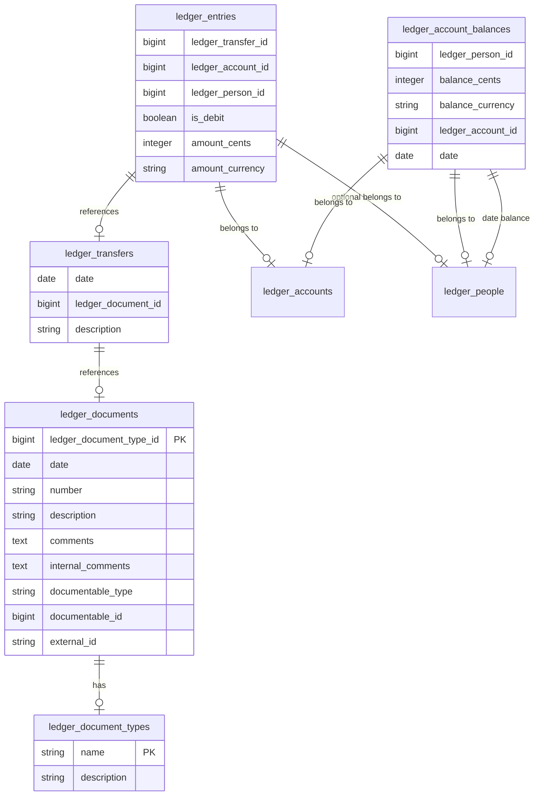
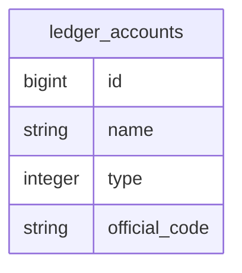
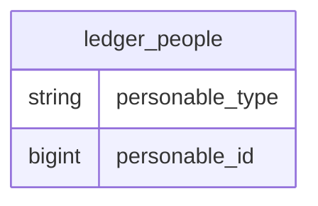

# Ledger

## Introduction

The Ledger gem is a comprehensive implementation of a double-entry bookkeeping system, following the principles of [Double-Entry Bookkeeping](http://en.wikipedia.org/wiki/Double-entry_bookkeeping_system). Key features include:

- Requires source documents
- Creates transfers and double-entry lines (which may exceed two) in the database
- Maintains current balances for each account

**Note:** This gem does _not_ enforce accounting rules beyond optionally ensuring positive balances and an allowlist of approved transfers. It utilizes the [Money gem](https://github.com/RubyMoney/money) for currency operations.

## What This Gem Does

- Provides a base table for documents, connectable to business models via a polymorphic association
- Includes a chart of accounts table where the `id` represents the account number (e.g., `ledger_accounts.id = 331`)

### Non-Rails Usage

If not using Rails, initialize with:

```ruby
MoneyRails::Hooks.init
```

## Installation

Replace `UPDATE_WITH_YOUR_GEM_NAME_PRIOR_TO_RELEASE_TO_RUBYGEMS_ORG` with your gem name after releasing it to RubyGems.org. If not releasing to RubyGems.org, replace this section with installation instructions from git.

To install and add the gem to your application's Gemfile, run:

```bash
$ bundle add UPDATE_WITH_YOUR_GEM_NAME_PRIOR_TO_RELEASE_TO_RUBYGEMS_ORG
```

If not using Bundler, install the gem with:

```bash
$ gem install UPDATE_WITH_YOUR_GEM_NAME_PRIOR_TO_RELEASE_TO_RUBYGEMS_ORG
```

## Usage



First of all you must setup 
- chart of accounts
- person
- use or opt-out of tenancy
- use or opt out of accounting periods

Then you can go to the actual double entry api, transfers.

### Chart of Accounts

The main accounts are stored in the `ledger_accounts` table, accessible via `Ledger::Accounts`. The `id` column represents the account number and should be provided by the user (it is not auto-incremented). Key attributes include:

- `id`: Account number (positive integer)
- `name`: Name of the account
- `type`: Type of account (`:passive`, `:active`, `:mixed`)
- `official_code`: Optional code for the account

```ruby
# Example account creation
Ledger::Accounts.new(id: 1200, name: "Accounts Receivable", type: :active)
```

#### Sub-accounts
The transfers between specific `person`s is implemented, however, if you would need to add additional sub-accounts, like for example a location to an account, and a `person` is not enough, you must extend the `person` table to handle that.



### Balances

*Details on managing balances will be added here.*

### Tenancy

*Tenancy support is optional.*

### Accounting Periods

*Accounting periods support is optional.*

### Transfers

Transfer money from one account to another with the following method, with a person account on either side, or none at all.
The `Ledger.transfer` is the main entry point. It accepts a not saved transfer object, that is required to have a `document`, `date` and other fields filled out.
A `Ledger.transfer` may process a single transaction or a set of transactions at the same time, by passing a `:transactions` hash key with an array of transaction hashes you 
execute multiple transactions.

When passing a `person`, it will `find_or_create` a account_balances entry for that `person`, `account`.
And `date` (read accounting period), and `tenant` if these options are included.

#### Parameters

- `transfer` [Ledger::Transfer::Instance]: A prepared transfer object (not saved in the db).
- `options` [Hash]: Options including:
  - `:amount` [Money]: Amount to transfer.
  - `:debit` [Ledger::Account::Instance, Integer]: Debit side.
  - `:credit` [Ledger::Account::Instance, Integer]: Credit side.
  - `:person_debit` [Ledger::Person::Instance]: Optional person on the debit side.
  - `:person_credit` [Ledger::Person::Instance]: Optional person on the credit side.
- `:transactions` [Array<Hash>]: Array of transaction hashes with the listed under options above for each element.


#### Examples
##### Single Transaction Without a Person

```ruby
transfer = Transfer.new(document: document, date: Date.today, description: 'Transfer description')
Ledger.transfer(
  transfer: transfer,
  amount: Money.new(20_00, 'USD'),
  debit: Ledger::Account.find_by(111),
  credit: 222
)
```

##### Single Transaction With a Person on Debit Side
Money is being transfered 
```ruby
transfer = Transfer.new(document: document, date: Date.today, description: 'Transfer description')
Ledger.transfer(
  transfer: transfer,
  amount: Money.new(20_00, 'USD'),
  debit: ledger_account_a,
  credit: ledger_account_b,
  person_debit: person_a
)
```

##### Single Transaction With People on Both Sides

```ruby
transfer = Transfer.new(document: document, date: Date.today, description: 'Transfer description')
Ledger.transfer(
  transfer: transfer,
  amount: Money.new(20_00, 'USD'),
  debit: ledger_account_a,
  credit: ledger_account_b,
  person_debit: person_a,
  person_credit: person_b
)
```

##### Complex Transfer With Multiple Transactions

```ruby
transfer = Transfer.new(document: document, date: Date.today, description: 'Transfer description')
Ledger.transfer(
  transfer: transfer,
  transactions: [
    {amount: Money.new(20_00, 'USD'), debit: account_a, credit: account_b},
    {amount: Money.new(20_00, 'USD'), debit: account_a, credit: account_c, person_debit: person_a}
  ]
)
```

### Errors

- `Ledger::TransferIsNegative`: Raised if the amount is less than zero.
- `Ledger::TransferAlreadyExists`: Raised if the transfer instance is already recorded.
- `Ledger::InsufficientMoney`: Raised if the account has insufficient funds.
- `Ledger::TransferNotAllowed`: Raised if the transfer is not permitted.

## Development
[](https://vscode.dev/redirect?url=vscode://ms-vscode-remote.remote-containers/cloneInVolume?url=https://github.com/merof-code/double_entry_ledger)


This gem uses development containers, with vs code. If you already have VS Code and Docker installed, you can click the badge above or [here](https://vscode.dev/redirect?url=vscode://ms-vscode-remote.remote-containers/cloneInVolume?url=https://github.com/merof-code/double_entry_ledger) to get started. Clicking these links will cause VS Code to automatically install the Dev Containers extension if needed, clone the source code into a container volume, and spin up a dev container for use.

Then, run `rake spec` to run the tests. 
You **can** also run `bin/console` for an interactive prompt that will allow you to experiment.

TODO: check this
To install this gem onto your local machine, run `bundle exec rake install`. To release a new version, update the version number in `version.rb`, and then run `bundle exec rake release`, which will create a git tag for the version, push git commits and the created tag, and push the `.gem` file to [rubygems.org](https://rubygems.org).


## Contributing

Bug reports and pull requests are welcome on GitHub at https://github.com/[USERNAME]/ledger. This project is intended to be a safe, welcoming space for collaboration, and contributors are expected to adhere to the [code of conduct](https://github.com/[USERNAME]/ledger/blob/master/CODE_OF_CONDUCT.md).

## License

The gem is available as open source under the terms of the [MIT License](https://opensource.org/licenses/MIT).

## Code of Conduct

Everyone interacting in the Ledger project's codebases, issue trackers, chat rooms and mailing lists is expected to follow the [code of conduct](https://github.com/[USERNAME]/ledger/blob/master/CODE_OF_CONDUCT.md).

## Thanks
Inspired by [`double_entry` gem by Envato](https://github.com/envato/double_entry), parts of the code have been copied over or adapted. 
And plutus gem
